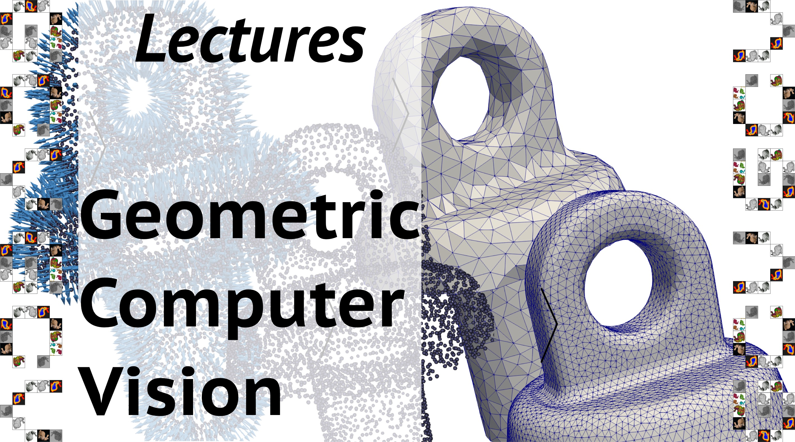

Lecture repository for Skoltech Geometric Computer Vision v.2021.1 (GCV 2021.1).

The links provided below are pointing to external resources outside this repository and may not be working at the time you access them. Alternatively you can simply clone the repository and access files here.

Week | Topic | YouTube Recording | Slides | Handout
---- | ----- | ----------------- | ------ | -------
1a | Course Introduction | [Zoom recording](https://drive.google.com/file/d/1_--J3csY-IfWItYRAf7umRoBZH1xgeVA/view?usp=sharing) |  [slides](https://drive.google.com/file/d/1cjdfUEN0Fr4yXApdJo_SMlDHGclz_PFR/view?usp=sharing) | [printer-friendly](https://drive.google.com/file/d/1CuAfY__4isf10V1GWVw36PWyO4VZtNwI/view?usp=sharing)
1b | The Geometry Processing Pipeline | [YouTube](https://www.youtube.com/watch?v=Zy0saJCJ2LM&list=PLwbgAkJDRI8uVcDRfEf_xyzO31vJX9pLo&index=1&t=2s) | [slides](https://drive.google.com/file/d/1x2MbJDo6LvTlFCL31t8uyxtvtaegJsly/view?usp=sharing) | [printer-friendly](https://drive.google.com/file/d/1rORSKMSkMXGYkdH2ZahGyFDfC7FFAkaz/view?usp=sharing)
1c | 3D representations in vision and graphics | [Zoom recording](https://drive.google.com/file/d/1j1btgvtQi2BogrONnEQN08-rB3rDX2L9/view?usp=sharing) | [slides](https://drive.google.com/file/d/1mpMFjyfR-2IIs_ESccG9lkxn_dmPKjlw/view?usp=sharing) | [printer-friendly](https://drive.google.com/file/d/1AFFmy68iCZHkqEqGpKv6i0P1-u9tcv1X/view?usp=sharing)
2  | Hardware systems for 3D data acquisition | [YouTube](https://www.youtube.com/watch?v=rA8WsHrNV0M&list=PLwbgAkJDRI8uVcDRfEf_xyzO31vJX9pLo&index=2) | [slides](https://drive.google.com/file/d/1OId_s1Fo52aG_BfEo-Tp0CwIR2PIBnyq/view?usp=sharing) | [printer-friendly](https://drive.google.com/file/d/1j68L0phGwFSfjsNSJLj-y-NgbqM29Di4/view?usp=sharing)
3  | Dense 2D Range-Images | [YouTube](https://youtu.be/r55eGJiwbuo) | [slides](https://drive.google.com/file/d/1oq3mHme5jCnwpDCUuCv00seDyTwC_vbo/view?usp=sharing) | [printer-friendly](https://drive.google.com/file/d/1PeAqCB6BO3iZEOwRcFYenfaT59M9-V3_/view?usp=sharing)
4  | Point set-based modalities | [YouTube](https://youtu.be/B7m6MNKdnyg) | [slides](https://drive.google.com/file/d/1dRyVsS-tJLbOesPO-ji-vMDNy3P5fGSG/view?usp=sharing) | [printer-friendly](https://drive.google.com/file/d/1L4EQXTwAnNtYm4rR0dSkSTETQLi2zgMz/view?usp=sharing)
